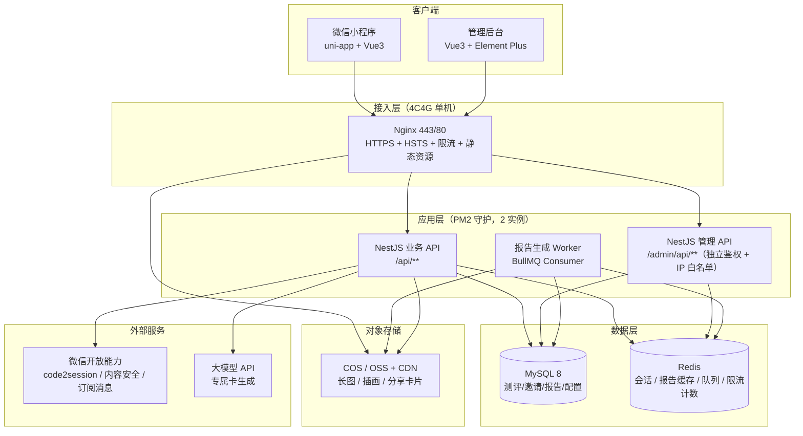
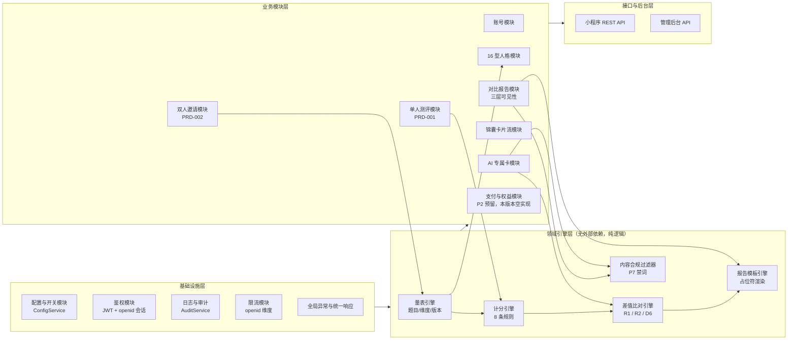
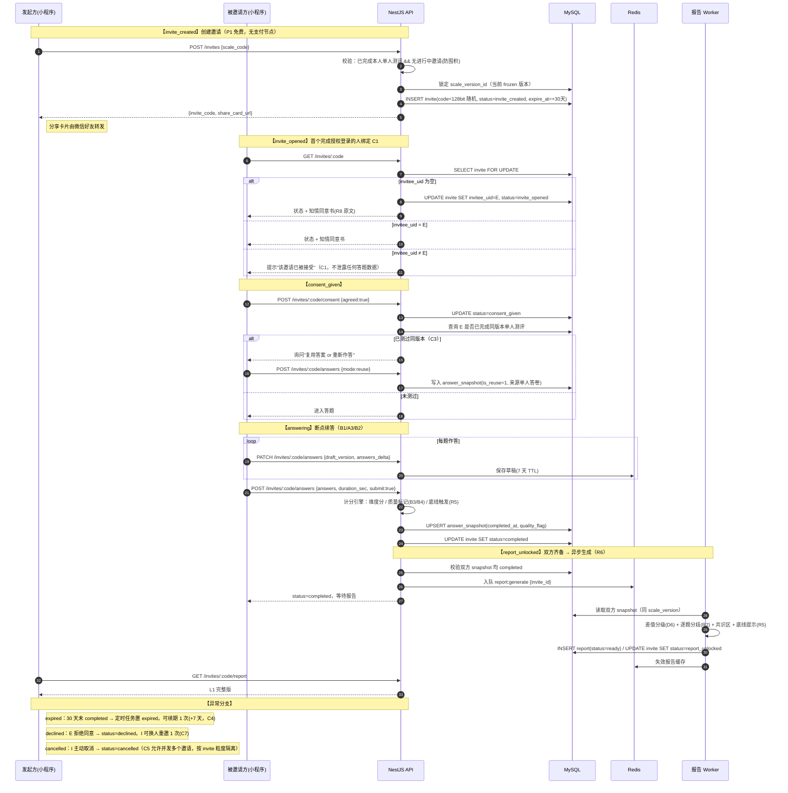
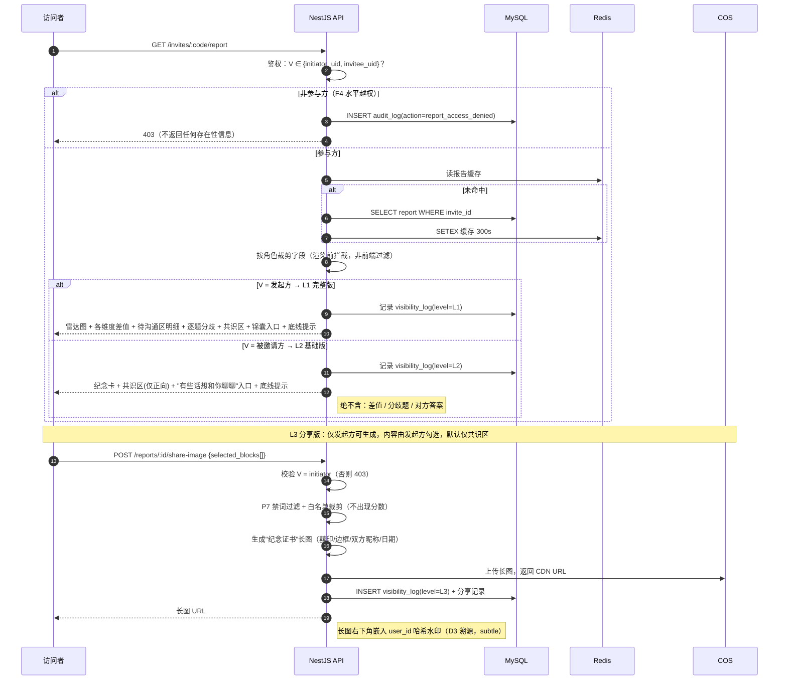
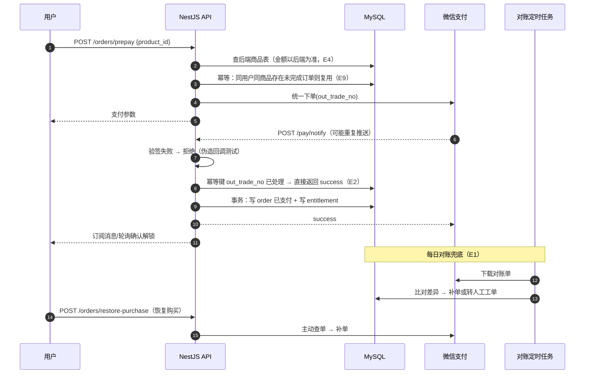

# 《知伴》架构设计 v0.1（阶段 1 产出）

> 唯一规格来源：`docs/constitution.md`（宪法 > 规范增补 v0.2/v0.3 > PRD > 边界总表）。
> 本文档**不含业务代码**，仅架构与契约设计。
> 阶段 0 裁决：见第 0 章。支付相关设计按「P1 全免费」标记为 P2 预留。

---

## 0. 阶段 0 裁决记录（Blocking，已获产品负责人确认）

| # | 议题 | 裁决 | 对规格的修订 |
|---|---|---|---|
| D-1 | 付费体系冲突（宪章 2.5 全免费 vs 定价 v0.2 / PRD-005） | **维持宪章「P1 全免费」**，本版本不接支付 | PRD-005 全部降级为 P2；《定价 v0.2》仅作 P2 储备；边界总表 E 域顺延 |
| D-2 | 计分公式 `均分×25`（5 点量表下为 25–125，不成立） | **修正为 `维度分 = (均分 - 1) × 25`**，区间 0–100 | 修订题库 v1.0 第三部分规则 2 |
| D-3 | 量表题数口径（79 / 70 / 实际 76） | **以实际列出的 76 题为准**：71 道维度题（含 Q27 风格题，不计分）+ 5 道底线题 | PRD-002「70 题」= 计分维度题数，非答题总数 |
| D-4 | 16 型人格图谱无流程规格但被专属卡引用 | **纳入 P1 完整实现**（`SCALE-16P-1.0` 24 题 + 单人答题/结果页） | 补 PRD-001 的最小实现范围（详见 §7 假设 A-3） |

### D-1 的级联处置（本设计已按此落地）

1. 模块 6（支付与权益 / PRD-005）整体推迟；`order` / `entitlement` / `coupon` 表**建表保留但不启用**，避免 P2 二次迁移。
2. 三层可见性（R3）的**数据裁剪规则不变**（它是隐私规则而非付费规则），但「被邀请方解锁完整版 = 独立付费点」失效，改为：被邀请方仅得 L2 基础版，L1 完整版**永远只归发起方**（不含任何解锁路径）。
3. 锦囊卡片流、AI 专属卡对全体登录用户开放；**成本闸门改由生成次数控制**：同一邀请同一议题仅生成 1 次并落库缓存，生成失败重试 1 次后降级通用版（依据增补 v0.3 §二，替换其「付费后触发」条件）。
4. 宪章 2.5「禁止诱导分享后强制解锁」在免费模式下自然满足；L3 分享版仍为发起方**主动勾选**生成。

---

## 1. 系统架构图

与规格《基础设施与部署方案 v0.1》§1 一致（Nginx / NestJS×2 / MySQL / Redis / COS）。

**关键架构约束**

- 小程序 API 与后台 API **路径分离、鉴权分离**（安全基线 §4）；后台仅 IP 白名单可达。
- 长图/插画一律走 COS + CDN，不占服务器带宽（§1）。
- 报告生成走 Redis 队列异步化（PRD-002 R6，≤10s，失败重试 3 次 → D1）。
- 队列选型：Redis + BullMQ（4C4G 单机不引入独立 MQ，避免运维负担）。

---

## 2. 模块划分与依赖关系图

**依赖规则（硬约束）**

1. L1 引擎层**禁止**依赖数据库/HTTP，只接受纯数据结构入参 → 保证 8 条计分规则可 100% 单元测试（模块 3 完成标准）。
2. L2 之间禁止横向调用（如「邀请模块」不得直接调用「报告模块」），统一经事件/应用服务编排。
3. `PAY` 模块在本版本为**空实现 + 接口占位**，`GET /entitlements` 固定返回全量权益（免费），保证前端判定逻辑不因 P2 上线而重写。

---

## 3. 关键时序图

### 3.1 双人邀请全流程（与 PRD-002 状态机逐节点对齐）

### 3.2 报告生成与三层可见性渲染（L1 / L2 / L3 的数据过滤）

### 3.3 支付到账与权益发放（**P2 预留，本版本不启用**）

> 依据 D-1 裁决，本版本无支付。下图为 P2 启用时必须实现的设计基线，本版本仅落表、不落逻辑。

---

## 4. 与 PRD-002 状态机逐节点对照（人审门禁核对项）

| 状态节点 | 触发动作 | 落地位置 | 对应边界条目 |
|---|---|---|---|
| `none` | 用户无邀请 | `invite` 表无记录 | — |
| `invite_created` | 发起方创建邀请 | §3.1 步骤 1–5；`invite.status` | C5（并发多邀请按粒隔离） |
| `invite_opened` | 首个授权登录者打开 | §3.1 步骤 6–13；`FOR UPDATE` 绑定 invitee_uid | C1（第三人提示"已被接受"） |
| `consent_given` | 知情同意勾选 | §3.1 步骤 14–22；R8 原文 | C7（declined 可换人 1 次） |
| `answering` | 答题/续答 | §3.1 步骤 23–29；Redis 草稿 + draft_version | B1 B2 B3 B4 B5 B7 A3 |
| `completed` | 被邀请方交卷 | §3.1 步骤 30–34 | C3（reuse 写入 `is_reuse=1`） |
| `report_unlocked` | 双方齐备→异步生成 | §3.1 步骤 35–42；BullMQ + 重试 3 次 | R6 D1 C10 |
| `expired` | 30 天未 completed | 定时任务；`expire_at` + 续期 1 次 | C4 |
| `declined` | 被邀请方拒绝同意 | `invite.status=declined` | C7 |
| `cancelled` | 发起方主动取消 | `invite.status=cancelled` | C5 |

---

## 5. 配置化落地清单（规格《配置项注册表》7 个配置域 + ADR-002 新增「站点域」）

| 配置域 | 落库表 | 管理后台页面 | 生效方式 |
|---|---|---|---|
| **量表域** | `scale` / `scale_version` / `scale_dimension` / `scale_question` | 量表管理 → 版本树编辑器（维度/题目/选项/反向/风格题/底线题开关） | 编辑 draft → 冻结生成新 version；进行中邀请锁定旧 version（B8/G1） |
| **计分域** | `scoring_rule` | 计分规则 → 聚合方式 / 差值阈值 / 评级命名 | 缓存 60s 失效，无需发版 |
| **报告域** | `report_template` / `report_template_block` | 报告模板 → 多维模板 + 占位符编辑器 + 可见层级开关 | 渲染时读取；改文案零发版 |
| **商品域** | `product`（P2 预留） | 商品管理（价格 / 权益 / iOS 可见性） | 本版本只读展示"免费" |
| **内容域** | `topic` / `topic_card` | 内容管理 → 议题卡片流编辑器（坑卡/话术卡/演练卡排序） | 上下架即时生效（G3） |
| **运营域** | `ops_slot` | 运营位 → 首页文案 / Banner / 弹窗 / 分享卡片 | 生效时间窗控制（G2） |
| **功能开关** | `feature_flag` | 开关管理 | Redis 缓存 + 变更广播，秒级生效 |
| **站点域**（ADR-002） | `sys_config` | 系统设置 → 品牌与站点（✅ 模块 8 切片已落地：列表 / 分组 / 编辑，只改不增删） | 不做缓存；`is_public=1` 的键经 `GET /api/v1/config/public` 下发，小程序下次冷启动读取，零发版 |

> 落地检验（G1 验收）：改一道题 / 改一处文案 / 下架一篇锦囊 → 全部为后台操作，**零发版**。

---

## 6. 安全基线映射（规格《基础设施与部署方案》§4 + 边界总表 F 域）

| 要求 | 落地设计 |
|---|---|
| 后台独立鉴权 + IP 白名单 + 二次验证 | 小程序 `/api/v1/**` 与后台 `/api/admin/**` 分离（ADR-003 决策 1 修订原 `/admin/api/**` 表述）；后台 JWT 独立签发（独立密钥 / `typ=admin` / 独立 Redis 键前缀 / 独立守卫四维隔离）+ TOTP 强制绑定；Nginx `allow/deny` + 应用层 `AdminIpGuard` 双层兜底 |
| 全局 rate limit（按 openid） | Redis 滑动窗口，鉴权中间件后置；邀请码查询单独更严阈值（C8） |
| 参数化查询防注入 | TypeORM 全量参数绑定，禁止字符串拼 SQL |
| 资源归属逐请求校验（F4） | `ReportAccessGuard` / `InviteAccessGuard`：校验 `viewer ∈ 参与双方`，越权写审计 + 告警 |
| 密钥管理 | 微信 appsecret / LLM key 走环境变量，禁止入库入仓 |
| 数据最小化（2.4） | 不采集真实姓名/身份证/通讯录/精确位置；昵称走内容安全接口（A6） |
| 注销物理删除（F1） | `account_deletion_request` 7 天冷静期 → 物理删除答题数据；订单表脱敏留存 |
| 审计 | `audit_log` 覆盖：报告访问、可见层级、专属卡生成、后台配置变更、越权尝试 |

---

## 7. 待确认假设（阶段 1 人审门禁）

| # | 假设 | 理由 / 影响 |
|---|---|---|
| A-1 | 答题进度分母 = **76 题**（含 Q27 风格题与 5 道底线题） | PRD-002「32/70」的分母与题库实际不符；若进度只算计分题则分母为 70，需二次确认 |
| A-2 | 被邀请方 **无任何路径**可见 L1 完整版 | D-1 取消付费解锁后的必然结论；若 P2 恢复付费，此条需回滚为「独立付费点」 |
| A-3 | 16 型人格图谱单人流程最小实现：入口 → 24 题 A/B → 类型结果页（自研类型名）→ 不生成深度报告 | 无 PRD 依据，按 P1 路线图「16 型快速版」最小兑现 |
| A-4 | 敏感维度（维度 8）拒绝授权后**保留事后补答入口**，补答后报告标记"补测" | B7 要求允许事后补答，但未定义补答对已生成报告的处理 |
| A-5 | 底线题提示文案采用题库原文（L419），双方**同一文案**、不含判词 | 落实 R5 / B9 / P7 例外条款 |
| A-6 | 队列用 Redis + BullMQ，不引入独立 MQ | 4C4G 单机运维成本最小化（规格 §2 容量评估支持） |
| A-7 | 16 型计分「=3 平局」统一取 **B 端**（并记录平局标记） | 题库规则 8 只写「中点偏向」未定义；取 B 端与 16 型命名表首列（B 端组合）自洽，需确认 |

---

## 8. 边界总表 C / E / F 域落实情况（人审门禁核对项）

### C. 邀请与双人流程

| # | 处理位置 |
|---|---|
| C1 邀请被转发第三人 | 时序图 §3.1 步骤 6–13：`invite` 行锁绑定首个 `invitee_uid`；他人打开仅返回"已被接受"文案 |
| C2 枪手代答 | 答题页固定文案 + 知情同意强化（前端文案，非技术拦截） |
| C3 已测过同版本 | 时序图 §3.1 步骤 17–22；`answer_snapshot.is_reuse` |
| C4 30 天不答 | `invite.expire_at` + `renewed_count`（≤1）+ `remind_count`（≤3）+ `job_task(type=invite_expire)` |
| C5 同时邀请多人 | `invite` 按行隔离，报告按 `invite_id` 粒度，无跨邀请可见路径 |
| C6 分手删数据 | `account_deletion_request` 物理删除本人数据；对方数据不可代删 |
| C7 拒绝同意 | `invite.status=declined` + 换人重邀 1 次（`invite` 历史行保留） |
| C8 邀请码枚举 | `invite.code` 128 位随机 + 查询接口独立更严限流 + `audit_log` 异常告警 |
| C9 一方催另一方 | 状态仅暴露 `answering`，无中间数据出口（`answer_sheet` 对非本人不可读） |
| C10 一方低质量标记 | `answer_snapshot.quality_flag` 仅在报告内统一提示，不单独暴露（模板固定块） |

### E. 支付与权益（**P2 预留，本版本不适用**）

| # | 状态 | 说明 |
|---|---|---|
| E1–E10 | 顺延 P2 | 表结构已就位（`order`/`entitlement`/`coupon`/`payment_notify_log`）；本版本 `PAY` 模块空实现，`GET /entitlements` 固定返回全量免费权益 |

> 依据阶段 0 裁决 D-1（维持宪章 P1 全免费）。恢复付费时按 §3.3 时序图实现，无需改表。

### F. 隐私、安全与合规

| # | 处理位置 |
|---|---|
| F1 用户注销 | `account_deletion_request`（7 天冷静期 → 物理删除）；订单依法留存脱敏 |
| F2 数据泄露应急 | 运维预案文档（阶段 3 产出）+ `audit_log` 可追溯 |
| F3 审核抽查数据导出 | 后台「合规检查工具」按 user_id 导出数据包（阶段 2 模块 8） |
| F4 水平越权 | 时序图 §3.2：`ReportAccessGuard` / `InviteAccessGuard` 逐请求校验归属，越权写 `audit_log` 并告警 |
| F5 爬虫刷接口 | Redis 滑动窗口限流（openid 维度）+ 内容安全接口 + 异常封禁 |
| F6 投诉报告不准 | 客诉话术 + 免责声明固定页脚（`report_template.disclaimer`） |

---

## 9. 变更文件清单（阶段 1）

| 文件 | 内容 |
|---|---|
| `docs/architecture.md` | 本文档：架构图、模块依赖、时序图、状态机对照、配置化清单、安全映射 |
| `docs/schema.sql` | 全部数据模型建表 SQL |
| `docs/adr/ADR-001.md` | 技术选型与配置化架构决策记录 |
